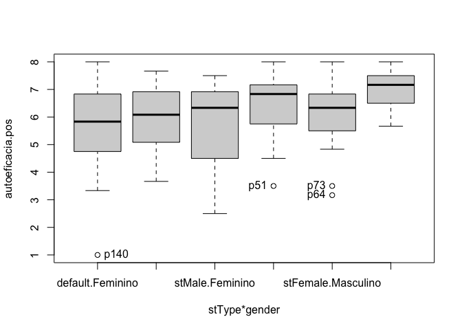
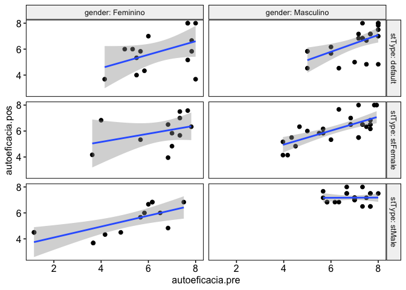
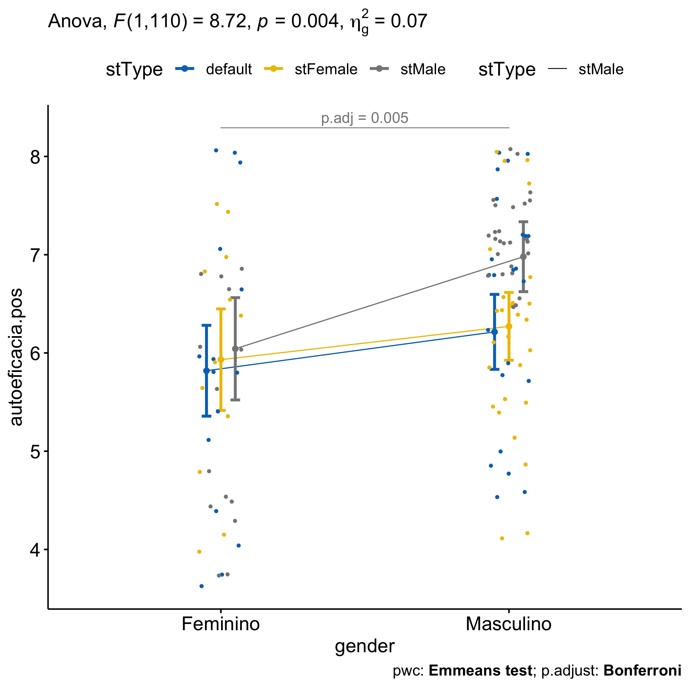

ANCOVA test for
`autoeficacia.pos`\~`autoeficacia.pre`+`stType`\*`gender`
================
Geiser C. Challco <geiser@alumni.usp.br>

- <a href="#initial-variables-and-data"
  id="toc-initial-variables-and-data">Initial Variables and Data</a>
  - <a href="#descriptive-statistics-of-initial-data"
    id="toc-descriptive-statistics-of-initial-data">Descriptive statistics
    of initial data</a>
- <a href="#checking-of-assumptions"
  id="toc-checking-of-assumptions">Checking of Assumptions</a>
  - <a href="#assumption-symmetry-and-treatment-of-outliers"
    id="toc-assumption-symmetry-and-treatment-of-outliers">Assumption:
    Symmetry and treatment of outliers</a>
  - <a href="#assumption-normality-distribution-of-data"
    id="toc-assumption-normality-distribution-of-data">Assumption: Normality
    distribution of data</a>
  - <a
    href="#assumption-linearity-of-dependent-variables-and-covariate-variable"
    id="toc-assumption-linearity-of-dependent-variables-and-covariate-variable">Assumption:
    Linearity of dependent variables and covariate variable</a>
  - <a href="#assumption-homogeneity-of-data-distribution"
    id="toc-assumption-homogeneity-of-data-distribution">Assumption:
    Homogeneity of data distribution</a>
- <a
  href="#saving-the-data-with-normal-distribution-used-for-performing-ancova-test"
  id="toc-saving-the-data-with-normal-distribution-used-for-performing-ancova-test">Saving
  the Data with Normal Distribution Used for Performing ANCOVA test</a>
- <a href="#computation-of-ancova-test-and-pairwise-comparison"
  id="toc-computation-of-ancova-test-and-pairwise-comparison">Computation
  of ANCOVA test and Pairwise Comparison</a>
  - <a href="#ancova-test" id="toc-ancova-test">ANCOVA test</a>
  - <a href="#pairwise-comparison" id="toc-pairwise-comparison">Pairwise
    comparison</a>
  - <a href="#descriptive-statistic-of-estimated-marginal-means"
    id="toc-descriptive-statistic-of-estimated-marginal-means">Descriptive
    Statistic of Estimated Marginal Means</a>
  - <a href="#ancova-plots-for-the-dependent-variable-autoeficaciapos"
    id="toc-ancova-plots-for-the-dependent-variable-autoeficaciapos">Ancova
    plots for the dependent variable “autoeficacia.pos”</a>
  - <a href="#textual-report" id="toc-textual-report">Textual Report</a>
- <a href="#tips-and-references" id="toc-tips-and-references">Tips and
  References</a>

## Initial Variables and Data

- R-script file: [../code/ancova.R](../code/ancova.R)
- Initial table file:
  [../data/initial-table.csv](../data/initial-table.csv)
- Data for autoeficacia.pos
  [../data/table-for-autoeficacia.pos.csv](../data/table-for-autoeficacia.pos.csv)
- Table without outliers and normal distribution of data:
  [../data/table-with-normal-distribution.csv](../data/table-with-normal-distribution.csv)
- Other data files: [../data/](../data/)
- Files related to the presented results: [../results/](../results/)

### Descriptive statistics of initial data

| stType   | gender    | variable         |   n |  mean | median |   min |   max |    sd |    se |    ci |   iqr | symmetry | skewness | kurtosis |
|:---------|:----------|:-----------------|----:|------:|-------:|------:|------:|------:|------:|------:|------:|:---------|---------:|---------:|
| default  | Feminino  | autoeficacia.pos |  15 | 5.633 |  5.833 | 1.000 | 8.000 | 1.918 | 0.495 | 1.062 | 2.083 | NO       |   -0.706 |   -0.057 |
| default  | Masculino | autoeficacia.pos |  23 | 6.435 |  6.833 | 3.500 | 8.000 | 1.243 | 0.259 | 0.537 | 1.417 | NO       |   -0.623 |   -0.624 |
| stFemale | Feminino  | autoeficacia.pos |  12 | 5.944 |  6.083 | 3.667 | 7.667 | 1.272 | 0.367 | 0.808 | 1.667 | YES      |   -0.327 |   -1.242 |
| stFemale | Masculino | autoeficacia.pos |  29 | 6.264 |  6.333 | 3.167 | 8.000 | 1.222 | 0.227 | 0.465 | 1.333 | NO       |   -0.527 |    0.212 |
| stMale   | Feminino  | autoeficacia.pos |  20 | 5.775 |  6.333 | 2.500 | 7.500 | 1.547 | 0.346 | 0.724 | 2.375 | NO       |   -0.793 |   -0.613 |
| stMale   | Masculino | autoeficacia.pos |  43 | 6.984 |  7.167 | 5.667 | 8.000 | 0.682 | 0.104 | 0.210 | 1.000 | YES      |   -0.128 |   -0.967 |
| NA       | NA        | autoeficacia.pos | 142 | 6.347 |  6.500 | 1.000 | 8.000 | 1.316 | 0.110 | 0.218 | 1.333 | NO       |   -1.149 |    1.625 |

<!-- -->

    ## [1] "p140" "p51"  "p64"  "p73"

## Checking of Assumptions

### Assumption: Symmetry and treatment of outliers

#### Applying transformation for skewness data when normality is not achieved

Applying transformation in “autoeficacia.pos” to reduce skewness

``` r
density.plot.by.residual(rdat[["autoeficacia.pos"]],"autoeficacia.pos",between,c(),covar)
```

<!-- -->

``` r
rdat[["autoeficacia.pos"]][["std.autoeficacia.pos"]] <- -1*sqrt(max(dat[["autoeficacia.pos"]][["autoeficacia.pos"]]+1) - dat[["autoeficacia.pos"]][["autoeficacia.pos"]])

density.plot.by.residual(rdat[["autoeficacia.pos"]],"std.autoeficacia.pos",between,c(),covar)
```

<!-- -->

#### Dealing with outliers (performing treatment of outliers)

``` r
rdat[["autoeficacia.pos"]] <- winzorize(rdat[["autoeficacia.pos"]],"autoeficacia.pos", c("stType","gender"),covar, skewness=skewness)
```

### Assumption: Normality distribution of data

#### Removing data that affect normality (extreme values)

``` r
non.normal <- list(
"autoeficacia.pos" = c("p37","p44","p50","p63","p69","p105","p04","p09","p10","p27","p28","p49","p79","p86","p88","p101","p110","p111","p121","p134","p142","p29","p48","p109","p120")
)
sdat <- removeFromDataTable(rdat, non.normal, wid)
```

#### Result of normality test in the residual model

|                  | var              |   n | skewness | kurtosis | symmetry | statistic | method     |     p | p.signif | normality |
|:-----------------|:-----------------|----:|---------:|---------:|:---------|----------:|:-----------|------:|:---------|:----------|
| autoeficacia.pos | autoeficacia.pos | 117 |   -0.204 |   -0.036 | YES      |      1.03 | D’Agostino | 0.597 | ns       | QQ        |

#### Result of normality test in each group

This is an optional validation and only valid for groups with number
greater than 30 observations

| stType   | gender    | variable         |   n |   mean | median |    min |    max |    sd |    se |    ci |   iqr | normality | method       | statistic |     p | p.signif |
|:---------|:----------|:-----------------|----:|-------:|-------:|-------:|-------:|------:|------:|------:|------:|:----------|:-------------|----------:|------:|:---------|
| default  | Feminino  | autoeficacia.pos |  15 | -1.763 | -1.780 | -2.828 | -1.000 | 0.527 | 0.136 | 0.292 | 0.588 | YES       | Shapiro-Wilk |     0.952 | 0.550 | ns       |
| default  | Masculino | autoeficacia.pos |  23 | -1.557 | -1.472 | -2.345 | -1.000 | 0.383 | 0.080 | 0.166 | 0.449 | YES       | Shapiro-Wilk |     0.952 | 0.319 | ns       |
| stFemale | Feminino  | autoeficacia.pos |  12 | -1.712 | -1.706 | -2.309 | -1.155 | 0.367 | 0.106 | 0.233 | 0.489 | YES       | Shapiro-Wilk |     0.975 | 0.954 | ns       |
| stFemale | Masculino | autoeficacia.pos |  27 | -1.657 | -1.633 | -2.415 | -1.000 | 0.351 | 0.068 | 0.139 | 0.290 | YES       | Shapiro-Wilk |     0.938 | 0.110 | ns       |
| stMale   | Feminino  | autoeficacia.pos |  14 | -1.921 | -1.933 | -2.550 | -1.472 | 0.374 | 0.100 | 0.216 | 0.543 | YES       | Shapiro-Wilk |     0.901 | 0.117 | ns       |
| stMale   | Masculino | autoeficacia.pos |  26 | -1.343 | -1.354 | -1.581 | -1.000 | 0.153 | 0.030 | 0.062 | 0.233 | YES       | Shapiro-Wilk |     0.924 | 0.056 | ns       |

**Observation**:

As sample sizes increase, parametric tests remain valid even with the
violation of normality \[[1](#references)\]. According to the central
limit theorem, the sampling distribution tends to be normal if the
sample is large, more than (`n > 30`) observations. Therefore, we
performed parametric tests with large samples as described as follows:

- In cases with the sample size greater than 100 (`n > 100`), we adopted
  a significance level of `p < 0.01`

- For samples with `n > 50` observation, we adopted D’Agostino-Pearson
  test that offers better accuracy for larger samples
  \[[2](#references)\].

- For samples’ size between `n > 100` and `n <= 200`, we ignored the
  normality test, and our decision of validating normality was based
  only in the interpretation of QQ-plots and histograms because the
  Shapiro-Wilk and D’Agostino-Pearson tests tend to be too sensitive
  with values greater than 200 observation \[[3](#references)\].

- For samples with `n > 200` observation, we ignore the normality
  assumption based on the central theorem limit.

### Assumption: Linearity of dependent variables and covariate variable

``` r
ggscatter(sdat[["autoeficacia.pos"]], x=covar, y="autoeficacia.pos", facet.by=between, short.panel.labs = F) + 
 stat_smooth(method = "lm", span = 0.9)
```

    ## `geom_smooth()` using formula = 'y ~ x'

<!-- -->

### Assumption: Homogeneity of data distribution

|                    | var              | method         | formula                    |   n | DFn.df1 | DFd.df2 | statistic |     p | p.signif |
|:-------------------|:-----------------|:---------------|:---------------------------|----:|--------:|--------:|----------:|------:|:---------|
| autoeficacia.pos.1 | autoeficacia.pos | Levene’s test  | `.res`\~`stType`\*`gender` | 117 |       5 |     111 |     3.474 | 0.006 | \*       |
| autoeficacia.pos.2 | autoeficacia.pos | Anova’s slopes | `.res`\~`stType`\*`gender` | 117 |       5 |     105 |     1.362 | 0.245 | ns       |

## Saving the Data with Normal Distribution Used for Performing ANCOVA test

``` r
ndat <- sdat[[1]]
for (dv in names(sdat)[-1]) ndat <- merge(ndat, sdat[[dv]])
write.csv(ndat, paste0("../data/table-with-normal-distribution.csv"))
```

Descriptive statistics of data with normal distribution

|                    | stType   | gender    | variable         |   n |  mean | median |   min |   max |    sd |    se |    ci |   iqr |
|:-------------------|:---------|:----------|:-----------------|----:|------:|-------:|------:|------:|------:|------:|------:|------:|
| autoeficacia.pos.1 | default  | Feminino  | autoeficacia.pos |  15 | 5.836 |  5.833 | 3.683 | 8.000 | 1.506 | 0.389 | 0.834 | 2.083 |
| autoeficacia.pos.2 | default  | Masculino | autoeficacia.pos |  23 | 6.481 |  6.833 | 4.533 | 8.000 | 1.144 | 0.239 | 0.495 | 1.417 |
| autoeficacia.pos.3 | stFemale | Feminino  | autoeficacia.pos |  12 | 5.960 |  6.083 | 3.949 | 7.575 | 1.217 | 0.351 | 0.773 | 1.667 |
| autoeficacia.pos.4 | stFemale | Masculino | autoeficacia.pos |  27 | 6.196 |  6.333 | 4.143 | 8.000 | 1.027 | 0.198 | 0.406 | 1.000 |
| autoeficacia.pos.5 | stMale   | Feminino  | autoeficacia.pos |  14 | 5.348 |  5.250 | 3.683 | 6.833 | 1.187 | 0.317 | 0.685 | 2.000 |
| autoeficacia.pos.6 | stMale   | Masculino | autoeficacia.pos |  26 | 7.173 |  7.167 | 6.500 | 8.000 | 0.401 | 0.079 | 0.162 | 0.625 |

<!-- -->

## Computation of ANCOVA test and Pairwise Comparison

### ANCOVA test

| var              | Effect           | DFn | DFd |    SSn |    SSd |      F | p       |   ges | p.signif |
|:-----------------|:-----------------|----:|----:|-------:|-------:|-------:|:--------|------:|:---------|
| autoeficacia.pos | autoeficacia.pre |   1 | 110 | 36.825 | 89.755 | 45.131 | \<0.001 | 0.291 | \*\*\*\* |
| autoeficacia.pos | stType           |   2 | 110 |  7.885 | 89.755 |  4.832 | 0.01    | 0.081 | \*\*     |
| autoeficacia.pos | gender           |   1 | 110 |  7.119 | 89.755 |  8.725 | 0.004   | 0.073 | \*\*     |
| autoeficacia.pos | stType:gender    |   2 | 110 |  1.753 | 89.755 |  1.074 | 0.345   | 0.019 | ns       |

### Pairwise comparison

| var              | stType   | gender    | group1   | group2    | estimate | conf.low | conf.high |    se | statistic |     p | p.adj | p.adj.signif |
|:-----------------|:---------|:----------|:---------|:----------|---------:|---------:|----------:|------:|----------:|------:|------:|:-------------|
| autoeficacia.pos | NA       | Feminino  | default  | stFemale  |   -0.113 |   -0.806 |     0.581 | 0.350 |    -0.322 | 0.748 | 1.000 | ns           |
| autoeficacia.pos | NA       | Feminino  | default  | stMale    |   -0.223 |   -0.921 |     0.474 | 0.352 |    -0.634 | 0.527 | 1.000 | ns           |
| autoeficacia.pos | NA       | Feminino  | stFemale | stMale    |   -0.111 |   -0.847 |     0.625 | 0.371 |    -0.298 | 0.766 | 1.000 | ns           |
| autoeficacia.pos | NA       | Masculino | default  | stFemale  |   -0.056 |   -0.574 |     0.462 | 0.261 |    -0.215 | 0.830 | 1.000 | ns           |
| autoeficacia.pos | NA       | Masculino | default  | stMale    |   -0.765 |   -1.278 |    -0.252 | 0.259 |    -2.957 | 0.004 | 0.011 | \*           |
| autoeficacia.pos | NA       | Masculino | stFemale | stMale    |   -0.709 |   -1.207 |    -0.211 | 0.251 |    -2.821 | 0.006 | 0.017 | \*           |
| autoeficacia.pos | default  | NA        | Feminino | Masculino |   -0.395 |   -0.994 |     0.203 | 0.302 |    -1.309 | 0.193 | 0.193 | ns           |
| autoeficacia.pos | stFemale | NA        | Feminino | Masculino |   -0.339 |   -0.961 |     0.283 | 0.314 |    -1.080 | 0.282 | 0.282 | ns           |
| autoeficacia.pos | stMale   | NA        | Feminino | Masculino |   -0.937 |   -1.586 |    -0.289 | 0.327 |    -2.864 | 0.005 | 0.005 | \*\*         |

### Descriptive Statistic of Estimated Marginal Means

| var              | stType   | gender    |   n | M (pre) | SE (pre) | M (unadj) | SE (unadj) | M (adj) | SE (adj) |
|:-----------------|:---------|:----------|----:|--------:|---------:|----------:|-----------:|--------:|---------:|
| autoeficacia.pos | default  | Feminino  |  15 |   6.510 |    0.343 |     5.836 |      0.389 |   5.819 |    0.233 |
| autoeficacia.pos | default  | Masculino |  23 |   7.058 |    0.210 |     6.481 |      0.239 |   6.215 |    0.192 |
| autoeficacia.pos | stFemale | Feminino  |  12 |   6.537 |    0.400 |     5.960 |      0.351 |   5.932 |    0.261 |
| autoeficacia.pos | stFemale | Masculino |  27 |   6.310 |    0.260 |     6.196 |      0.198 |   6.271 |    0.174 |
| autoeficacia.pos | stMale   | Feminino  |  14 |   4.952 |    0.526 |     5.348 |      0.317 |   6.042 |    0.263 |
| autoeficacia.pos | stMale   | Masculino |  26 |   6.897 |    0.128 |     7.173 |      0.079 |   6.980 |    0.179 |

| var              | stType   | gender    | autoeficacia.pre | emmean | se.emms |  df | conf.low | conf.high | method       |   n |  mean | median |   min |   max |    sd |    se |    ci |   iqr | n.autoeficacia.pre | mean.autoeficacia.pre | median.autoeficacia.pre | min.autoeficacia.pre | max.autoeficacia.pre | sd.autoeficacia.pre | se.autoeficacia.pre | ci.autoeficacia.pre | iqr.autoeficacia.pre | sd.emms |
|:-----------------|:---------|:----------|-----------------:|-------:|--------:|----:|---------:|----------:|:-------------|----:|------:|-------:|------:|------:|------:|------:|------:|------:|-------------------:|----------------------:|------------------------:|---------------------:|---------------------:|--------------------:|--------------------:|--------------------:|---------------------:|--------:|
| autoeficacia.pos | default  | Feminino  |            6.474 |  5.819 |   0.233 | 110 |    5.357 |     6.281 | Emmeans test |  15 | 5.836 |  5.833 | 3.683 | 8.000 | 1.506 | 0.389 | 0.834 | 2.083 |                 15 |                 6.510 |                   6.000 |                4.150 |                8.000 |               1.327 |               0.343 |               0.735 |                2.250 |   0.903 |
| autoeficacia.pos | default  | Masculino |            6.474 |  6.215 |   0.192 | 110 |    5.833 |     6.596 | Emmeans test |  23 | 6.481 |  6.833 | 4.533 | 8.000 | 1.144 | 0.239 | 0.495 | 1.417 |                 23 |                 7.058 |                   7.333 |                5.000 |                8.000 |               1.006 |               0.210 |               0.435 |                1.167 |   0.923 |
| autoeficacia.pos | stFemale | Feminino  |            6.474 |  5.932 |   0.261 | 110 |    5.415 |     6.448 | Emmeans test |  12 | 5.960 |  6.083 | 3.949 | 7.575 | 1.217 | 0.351 | 0.773 | 1.667 |                 12 |                 6.537 |                   7.000 |                3.625 |                7.817 |               1.385 |               0.400 |               0.880 |                0.792 |   0.903 |
| autoeficacia.pos | stFemale | Masculino |            6.474 |  6.271 |   0.174 | 110 |    5.925 |     6.616 | Emmeans test |  27 | 6.196 |  6.333 | 4.143 | 8.000 | 1.027 | 0.198 | 0.406 | 1.000 |                 27 |                 6.310 |                   6.833 |                3.967 |                7.933 |               1.353 |               0.260 |               0.535 |                2.167 |   0.905 |
| autoeficacia.pos | stMale   | Feminino  |            6.474 |  6.042 |   0.263 | 110 |    5.522 |     6.563 | Emmeans test |  14 | 5.348 |  5.250 | 3.683 | 6.833 | 1.187 | 0.317 | 0.685 | 2.000 |                 14 |                 4.952 |                   5.750 |                1.158 |                7.500 |               1.969 |               0.526 |               1.137 |                2.375 |   0.983 |
| autoeficacia.pos | stMale   | Masculino |            6.474 |  6.980 |   0.179 | 110 |    6.624 |     7.335 | Emmeans test |  26 | 7.173 |  7.167 | 6.500 | 8.000 | 0.401 | 0.079 | 0.162 | 0.625 |                 26 |                 6.897 |                   7.000 |                5.667 |                8.000 |               0.655 |               0.128 |               0.265 |                0.667 |   0.915 |

### Ancova plots for the dependent variable “autoeficacia.pos”

``` r
plots <- twoWayAncovaPlots(sdat[["autoeficacia.pos"]], "autoeficacia.pos", between
, aov[["autoeficacia.pos"]], pwc[["autoeficacia.pos"]], addParam = c("jitter"), font.label.size=14, step.increase=0.25, p.label="p.adj")
```

#### Plot for: `autoeficacia.pos` \~ `stType`

``` r
plots[["stType"]]
```

<!-- -->

#### Plot for: `autoeficacia.pos` \~ `gender`

``` r
plots[["gender"]]
```

<!-- -->

### Textual Report

After controlling the linearity of covariance “autoeficacia.pre”, ANCOVA
tests with independent between-subjects variables “stType” (default,
stFemale, stMale) and “gender” (Feminino, Masculino) were performed to
determine statistically significant difference on the dependent varibles
“autoeficacia.pos”. For the dependent variable “autoeficacia.pos”, there
was statistically significant effects in the factor “autoeficacia.pre”
with F(1,110)=45.131, p\<0.001 and ges=0.291 (effect size) and in the
factor “stType” with F(2,110)=4.832, p=0.01 and ges=0.081 (effect size)
and in the factor “gender” with F(1,110)=8.725, p=0.004 and ges=0.073
(effect size).

Pairwise comparisons using the Estimated Marginal Means (EMMs) were
computed to find statistically significant diferences among the groups
defined by the independent variables, and with the p-values ajusted by
the method “bonferroni”. For the dependent variable “autoeficacia.pos”,
the mean in the stType=“default” (adj M=6.215 and SD=1.144) was
significantly different than the mean in the stType=“stMale” (adj M=6.98
and SD=0.401) with p-adj=0.011; the mean in the stType=“stFemale” (adj
M=6.271 and SD=1.027) was significantly different than the mean in the
stType=“stMale” (adj M=6.98 and SD=0.401) with p-adj=0.017; the mean in
the gender=“Feminino” (adj M=6.042 and SD=1.187) was significantly
different than the mean in the gender=“Masculino” (adj M=6.98 and
SD=0.401) with p-adj=0.005.

## Tips and References

- Use the site <https://www.tablesgenerator.com> to convert the HTML
  tables into Latex format

- \[2\]: Miot, H. A. (2017). Assessing normality of data in clinical and
  experimental trials. J Vasc Bras, 16(2), 88-91.

- \[3\]: Bárány, Imre; Vu, Van (2007). “Central limit theorems for
  Gaussian polytopes”. Annals of Probability. Institute of Mathematical
  Statistics. 35 (4): 1593–1621.